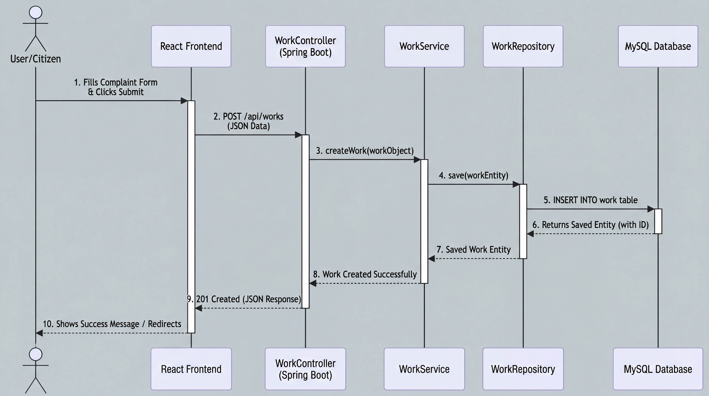

# Complaint Management System

A full-stack application built to manage user complaints efficiently. It includes a robust Spring Boot backend and a dynamic React.js frontend.

## 🏗️ System Architecture


The application follows a standard client-server, three-tier architecture:
1. **Presentation Layer (Frontend)**: Developed with React.js, it offers a responsive and interactive user interface. It communicates with the backend asynchronously using RESTful APIs.
2. **Application Layer (Backend)**: Powered by Spring Boot, this layer is responsible for core business logic, API request handling, and data validation. It is structured into Controllers (handling HTTP requests), Services (executing business rules), and Repositories (managing data access).
3. **Data Access Layer (Database)**: A MySQL relational database is utilized to persistently store user profiles, complaint records, and system data. Spring Data JPA (backed by Hibernate) acts as the ORM, seamlessly mapping Java objects to database tables.

## 🛠️ Tech Stack

### Frontend (User Interface)
- **React.js**: Used for building the component-based user interface.
- **HTML/CSS/JS**: Core web technologies used for structure and styling.

### Backend (Server Side)
- **Java**: The primary programming language used for the backend.
- **Spring Boot**: Framework used to develop REST APIs.
- **Spring Data JPA**: Used for database interactions and Object-Relational Mapping (ORM).
- **Hibernate**: The default JPA implementation used for handling database schemas.
- **Maven**: Build and dependency management tool.

### Database
- **MySQL**: Relational database used for storing user and complaint data.

## ⚙️ Workflow & Sequence



The system operates on a clean, request-response lifecycle:

1. **User Interaction**: Users register or file a complaint via the React frontend. The UI captures the data, performs initial client-side validation, and constructs a JSON payload.
2. **API Communication**: The frontend transmits the payload via an HTTP POST/GET request to the designated Spring Boot endpoint.
3. **Business Processing**: The Backend Controller receives the HTTP request and delegates it to the Service layer. The Service layer applies necessary business logic and data transformations.
4. **Database Persistence**: The Service invokes the JPA Repository to save or retrieve entities. The Repository translates these interactions into SQL queries executed against the MySQL database.
5. **UI Update**: Once the database transaction is complete, the backend returns a standardized JSON response to the frontend, which dynamically updates the view to reflect the success or failure of the operation.

## 🚀 How to Run the Project Locally

### 1. Database Setup (MySQL)
1. Ensure **MySQL server** is installed on your system.
2. Create a new database in MySQL (e.g., `cms_db`).
3. Open the `src/main/resources/application.properties` file in the project folder.
4. Update the following lines with your database credentials:
   ```properties
   spring.datasource.url=jdbc:mysql://localhost:3306/your_database_name?allowPublicKeyRetrieval=true&useSSL=false
   spring.datasource.username=your_mysql_username
   spring.datasource.password=your_mysql_password
   ```

### 2. Backend Setup (Spring Boot)
1. Ensure **Java (JDK 11 or later)** and **Maven** are installed on your system.
2. Open a terminal and navigate to the project root directory (where the `pom.xml` file is located).
3. Run the following command to start the backend:
   ```bash
   mvn spring-boot:run
   ```
4. The backend server will start at `http://localhost:9000`.

### 3. Frontend Setup (React JS)
1. Ensure **Node.js** and **npm** are installed on your system.
2. Open a new terminal and navigate to the `ReactApp` folder:
   ```bash
   cd ReactApp
   ```
3. Run the following command to install the necessary dependencies:
   ```bash
   npm install
   ```
4. Start the React development server by running:
   ```bash
   npm start
   ```
5. The frontend will automatically open in your browser at `http://localhost:3000`.

---
**Note:** For the application to work properly, both the backend and frontend servers must be running simultaneously.